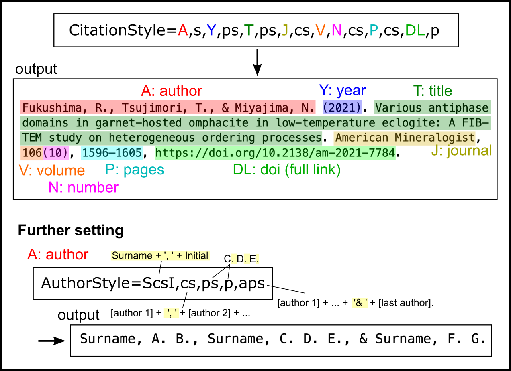

# **Citation style manual (for BibQuick v1.0.x)**

## Graphical abstract

## 1. Overall structure
The overall structure of citation is designated mainly by the `CitationStyle` parameter. 

Individual blocks (abbreviated by uppercase letters) of the bibliographic information and some signs (abbreviated by lowercase letters) should be placed in order as a comma-delimited style. **Don't insert any space between the items!**

if you need, you can add any letters by using the `AddLetters` parameter. Type strings as a comma-delimited style, and type the non-negative integer (e.g., 0, 1, 2, ...) in `CitationStyle` to set the locations of the individual items.

### Block
* A: author
* Y: year
* T: title
* J: journal
* V: volume
* N: number
* P: pages
* U: url
* D: doi (raw data)
* DD: doi (after doi:)
* DL: doi (full link)

### Sign
* s: space ( )
* p: period (.)
* c: comma (,)
* cl: colon (:)
* sc: semicolon (;)
* ps: period + space (. )
* cs: comma + space (, )
* cls: colon + space (: )
* scs: semicolon + space (; )
* q: single quotation (')
* dq: double quotation (")
* ap: ampersand (&)
* bsap: backslash + ampersand (\\&) (for LaTeX)
* a: and (and)
* aps: ampersand + space (& )
* bsaps: backslash + ampersand + space (\\& ) (for LaTeX)
* as: and + space (and )
* n: none ()

## 2. Further setting

1. Author block

   Author names' expression is controlled by the parameters of `AuthorStyle`, `ManyAuthors`, `ManyAuthorsOption`, and `EtAlExpression`.

   * `AuthorStyle` is composed of 5 items (comma-delimited; *X1*,*x2*,*x3*,*x4*,*x5*). *X1* should be either of {SsF, ScsF, SsI, ScsI, FsS, FcsS, IsS, IcsS} to set a person's name expression. The uppercase letters (S, F, I) respectively mean surname, firstname, and initialized firstname. For the meaning of the lowercase letters, please refer to the sign list above. *x2* is a parameter to set the delimiter between authors. *x3* is the delimiter between multiple initial letters, and *x4* is the sign placed at the last of the initialized firstname of each person. *x5* is the sign before the last author's name. *x2*-*x5* should be chosen from the sign list above. 
  
   * If `ManyAuthors=yes`, the following settings for many authors will be applied.
   * `ManyAuthorsOption` is composed of 3 non-negative integers (comma-delimited; *n1*,*n2*,*n3*). If the total number of the authors is more than *n1*, only the first *n2* authors' names will be displayed. *n3* should be 1 or 0, and if *n3* = 1, the last author's name will also appear.
   * `EtAlExpression` is a string appearing just before the last author (if *n3* = 1) or in the end of the author block (if *n3* = 0). (If *x5* in `AuthorStyle` has any value, the designated sign by *x5* will be neglected.) **Enclosing the string with @ is recommended so that any space in it can be correctly reflected.**

1. Year and number blocks
   
   `YearPar` and `NoPar` should be `yes` if you need parentheses for the year and number blocks, respectively (e.g., (2024)).
   

## 3. Other parameters

If `PlainConvert=yes`, all the letters will be converted from TeX-specific expression into the plain text.

`Template` is just a name tag for the citation style template. This appears in the console at the beginning of each session.

## Note

- There are two options for the doi block (DD, DL) to unambiguously fix the doi style.
- From **BibQuickParams.ini**, only parameter values in the `[CurrentParameters]` section will be imported. You can save your original template in **BibQuickParams.ini** by setting another section name.

## Author

Ryo Fukushima (rpifukushima@gmail.com)

